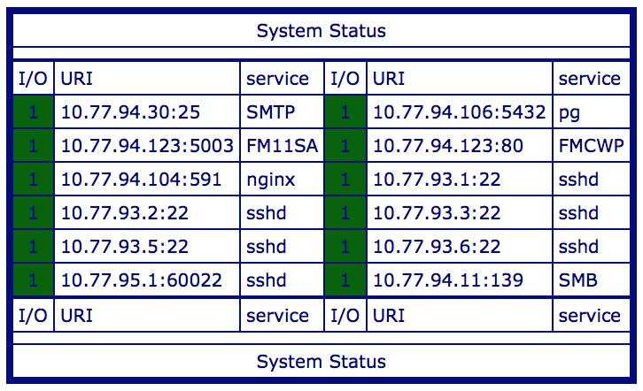

# SystemStatus
php/phtml script that tells which ports from your array of services are open; tested with phtml through php5.

I assume most people would rather use ELK-stack these days; yet this approach is extremely simple.
